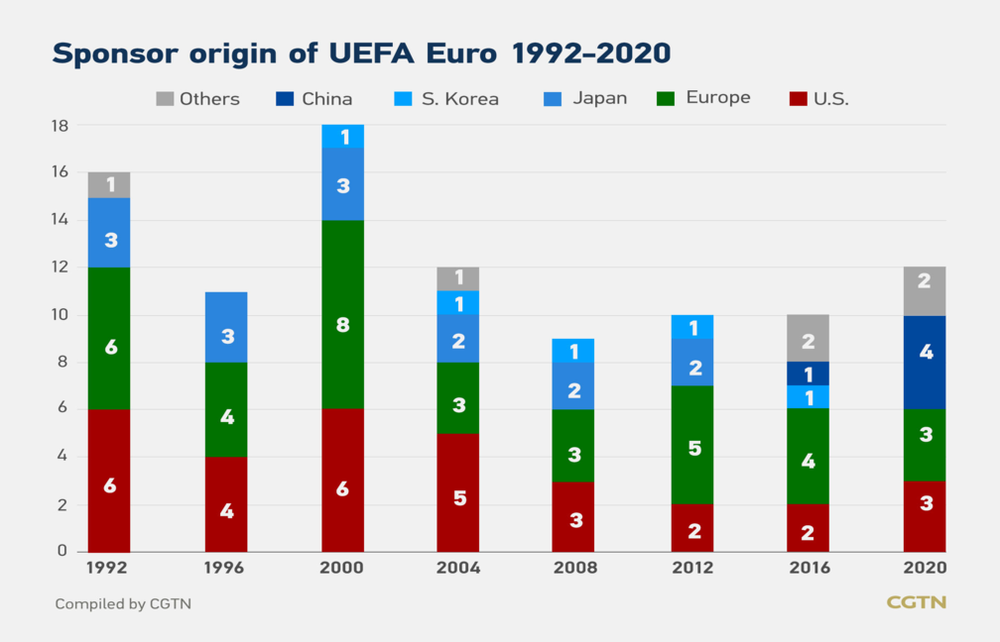

# How UEFA Euro sponsorship mirrors global economic shifts?
### *The charm of information visualization*
------

Forty years ago, China and the United States engaged in "ping pong diplomacy", which is known as that “the small ball drives the big ball”, with the small ball representing ping pong and the big ball representing the economy. Today, another ball, football, reflects the economic shifts of China and other countries in the last decades. In this project, we will take the visualization and improve it to show this interesting finding.

**Source: The original visualization is the third graph in this [website](https://news.cgtn.com/news/2021-07-10/Graphics-How-UEFA-Euro-sponsorship-mirrors-global-economic-shifts-11MBzioNRhm/index.html).**

------

## Abstract

In this essay, starting with a visualization showing how UEFA Euro sponsorship mirrors global economic shifts. We will discuss the importance, the visual variables and the meaning of this visualization. Then, we will talk about the room for improvements of this visualization. After this, we will dig for the back story. And along with the narrative, we will discuss the details of how to improve this visualization. Finally, after ending the story, we will finish this essay with the conclusion and the blueprint of future work.

The structure of this article will be organized as follows:
+ **Introduction**
  > The importance and meaning of this visualization
  > The disadvantages of the visualization and breif introduction of the improvements.
+ **Setting of the story**
  > The details about the story and why we choose this visualization
+ **Events**
  > The improvements that we made and its advantage.
  > How to apply them to other graph.
+ **End of the story**
  > or the start of a new story
+ **Conclusion and the blueprint for a new story**
------
## Introduction
>*‘Money has no smell, it is a blessing for the ease of human life’
-- the Talmud Bavli*

This sentence reveals the relationships between the economy and people. Economy is closely related to all countries in the world, and is also closely related to the lives of people. 

***We know the economy is changing, but how can we prove that?***

 &emsp;&emsp;As ordinary citizens, we don’t have realistic feelings when we see the cold number of the GDP. However, many aspects of life can reflect the economic shifts which is the effect of this visualization. In general, this visulization mirrors the global economic shifts with an special way which shows changes of various countries' sponsorship of UEFA from 1998 to 2020. The change of sponsors presented an interesting relation with the global economic shifts. 
 **This is why the visualization is important and brief introduction of its social impact.**

 Through the visualization display 
 + With horizontal comparison, it shows that there are three categories of the overall sponsorship shift: stable, increasing and decreasing. For example: the number of sponsorship from China is increasing. Japanese sponsorship is decreasing. And the overall trend of the number of sponsorship from U.S. and Europe is stable. 
 + With vertical comparison, we can find that China became the largest source country of sponsorship with the largest sponsorship proportion at 2020. 
 The proportion of the sponsorship from Europe and U.S. is stable. The number of their sponsorship fluctuated because of the fluctuation of the total sponsor number.

**The graph below is the original visualization** 
 
 
 ***Figure 1: This is the original visualization***

**This is the graph that we replicate** 
 
 
 ***Figure 2: This is the visualization that we replicate by ourselves***

 **The [visual variables:](https://infovis-wiki.net/wiki/Visual_Variables)**

 ***Table 1: The visual variables and corresponding datatypes***

|   Visual Variable       |                              Data Type                          |
|-------------------------|:---------------------------------------------------------------:|
| Position in X-axis      |                      Holding year                           |
| Position in Y-axis      |               Total number of the sponsors                      |
|Color of each rectangular|               Different countries (categories)                  |
|Size of each rectangular |               Number of the sponsors                            |
|         Labels          |               Number of the sponsors                            |
|      Color and Size     |         Number of the sponsors in different countries           |
|   Color and Position    |          Different countries in different years                 |
| Color, Size and Position|Number of the sponsors for different countries in different years|

 &emsp;&emsp;This graph shows that the overall international economy is stable. Among these countries, Japan may be in trouble for an economic downturn. Yet, China is in a good period of development, and China's economy is growing steadily.

 &emsp;&emsp; What's more, this graph can also reveal the global economic landscape shift. In 2010, China overtook Japan as the world's second largest economy. And in the visualization, Chinese sponsorship exceeded Japanese sponsorship after UEFA Euro 2012.

***However, there's something wrong with this visualization, so what is it?***

For the first sight, we may cannot find them. So let me show you another plot.

***Figure 3: The graph seen from the perspective of a red-blind person***

This is the visualization seen from the perspective of a red-blind person. If we put red and green together, they cannot find the differences between them. You can check this from their view with tools like [Coblis](https://www.color-blindness.com/coblis-color-blindness-simulator/).
Besides this, there are also some other disadvantages:
1. The grid, the border and the background color will distract us.
2. The similar colors of S.korea and Japan are hard to be distinguished.
3. Too many color makes it is hard to catch the point and know how UEFA Euro sponsorship mirrors global economic shifts.

***So how can we improve it?***

The brief introduction of the improvements:
+ We change the colors to represent each country.
+ And we remove the unwanted elements in this visualization like the grid, the background color, etc. 
+ Moreover, we use China and Japan as typical examples to show how UEFA Euro sponsorship mirrors global economic shifts. So their colors are bright.

<!DOCTYPE html>
<html>
<head>
    <meta charset="UTF-8">
    <title>Sponsor origin of UEFA Euro 1992-2020</title>
            

</head>
<body>
    

    
</body>
</html>

***Figure 4: This is the improved interactive graph***

After deleting the left border, background color and the grid lines. There is nothing else to distract and the data key features stand out clearly. With highlight colors of China and Japan and the marker to emphasize the important data, we can easily catch the sponsorship shifts at the first sight.

------
## Setting of the story

>*"While looking forward to the performance of football stars of the next European Championship, I am also waiting to see what other Chinese brands will become sponsors besides Hisense and other brands"*

It was a Chinese football fan's comment on a [news report about UEFA Euro 2020](https://baijiahao.baidu.com/s?id=1705250905460495337&wfr=spider&for=pc). This reflects what a Chinese sponsor in the championship can bring to the Chinese fans -- **the sense of identity and pride**. Also, for all the people who don't playing football, seeing this, they will know that China's economy is developing rapidly.

***This comment reveals the reason why we choose this visualization***

&emsp;&emsp;Firstly, this visualization reveals the global economic shifts in an interesting way which is attractive and easy for the people to understand. And as an aspact of the popular sport, football, it is much more impressive than the cold data of the GDP values and the citizens will remember this. 
&emsp;&emsp;Besides, the epidemic is still not over, and the emotions of the citizens are generally down. So with showing the rapid economic development of China in an interesing way, this visualization helps to cheer up the people.

***What the graph is about and how to read it***

1. According to the visualization. Firstly, we focus on the sponsors from Asia. 
    - Between 1992 and 2012, Japanese companies were the largest sponsors of UEFA Euro in Asia.
    - But from 2016, Japanese sponsors started to be absent from UEFA Euro. Instead, some Chinese companies started to enter our sight as sponsors of UEFA Euro. There was the first sponsor from China in UEFA Euro 2016. And in 2020, there were 4 sponsors from China, accounting for one third of the total.
    - 2012 is like a turning point. It is the first UEFA Euro after China became the world's second largest economy. And from this year, Chinese sponsors started to increase from zero, finally became the most in UEFA Euro 2020.
    - Because the sponsors from S.Korea are intervalic, which is low in research value, we will skip it in the next analyse.
2. Secondly, as for the Europe and U.S.
   - With horizontal comparison, the overall trend of the sponsorships of Europe and U.S. are stable with a little fluctuation.
   - But with vertical comparison we can find the fluctuation mentioned before is caused by the fluctuation of total number. Their proportion are stable.

***Why the UEFA Eruo can mirror the global economy shifts?***

&emsp;&emsp;Recent years, as highly developed country and area, the American and European enconomy are stable which is obvious in the graph.

**However, there are large up and down for China and Japan, so we will use them as remarkable example to discuss why the UEFA Eruo can mirror the global economy shifts.**

&emsp;&emsp;For the Japanese economy, Japanese companies sponsored every Euro Championship from 1992 to 2012, thanks to the country's leading consumer electronics development. But for rencet years, because of an aging population and the [suply problem](https://edition.cnn.com/2021/11/15/economy/japan-economy-gdp-slumps/index.html), the Japan's economy is on a downward trend. So we can see that Japanese sponsors have been completely absent in the latest two tournaments in 2016 and 2020, replaced by those from China.

&emsp;&emsp;As for the economy of China, it is growing rapidly in recent years. China has maximized its convergence with developed countries in various sectors such as education, health care, which contribute a significant amount of GDP revenue to China.

&emsp;&emsp;Besides, this visualization can also reflect the economic landscape shift. We mark 2012 especially because it is the first UEFA Euro after China became the world's second largest economy. And after that, the number of sponsors from Japan decreased to zero and inversely, that of China increased to the most one in 2020.

***How this story relates to myself?*** 
**Said by one of our teammates:**
>Football, as the top one sport in the world, attracts many people, and I am no exception. I am a fan of Cristiano Ronaldo who led Portugal to the UEFA Euro 2016 title today with a weak victory. 
>And for the latest two UEFA Euro in 2016 and 2020, I also feel pround to see the Chinese sponsors in the broadcast. And this visualization is attractive for me to know the global economic shift in this way.

------
## What are the events?

<!DOCTYPE html>
<html>
<head>
    <meta charset="UTF-8">
    <title>Sponsor origin of UEFA Euro 1992-2020</title>
            

</head>
<body>
    

    
</body>
</html>

***Figure 5: This is the improved interactive graph***

**Here are the details of the improvements**
1. First of all, there is color problem. The red and green are unfriendly to people who are red or green color blind. We avoid to use them together. Also, we use the [Coblis](https://www.color-blindness.com/coblis-color-blindness-simulator/) to test if the colors we use are friendly to colorblind people.
2. We want to use China and Japan as typical examples to show that how the UEFA Euro sponsorship mirrors global economic shifts. So in order to make the information stand out, we use red and gold color to represent China and Japan.
3. Another reason why we represent China with red is that in common sense, red is one of the representative color of China because of the national flag and the Spring Festival. This is the [procedural knowledge](http://cognitivemodelinglab.com/index.php/proceduralization/) that psychologists refer to.
4. And we add the red marker in 2012 which is the first UEFA Euro Championship after China has become the world’s second largest economy to reveal how UEFA Euro sponsorship mirrors global **economic landscape shifts**.
5. Also, we remove the grid, the left border and the background color for higher [ink ratio](https://infovis-wiki.net/wiki/Data-Ink_Ratio#:~:text=The%20Data-Ink%20ratio%20is%20a%20concept%20introduced%20by,data-information%2C%20the%20ink%20changing%20as%20the%20data%20change.) to design effective data presentations. There is nothing else to distract and the data key features stand out clearly.
6. We use interactive graph to make the visualization more intersting.

***For what situation these changes can also be applied to other generic graphs?***

1. **Color problems**: 
    - When the color selection will cause distinguishing problems for other people (e.g. color-blindness), we should change the colors.
    - When we are choosing the colors, we should also consider about the common sense. For example we can rapidly recognize green as “good” ✅ and red as “wrong” ⛔.
    - For what we want to emphasize, we can use bright colors which will catch people's attention.
2. **Attention probelms**: Many unnecessary elements in the graph will distract us. In psychology, they are also called unwanted cognitive tunneling. We should eliminate them including the grid and the background color to provide a minimum amount of information to make sense of the issue.
3. **Interestingness**: For interestingness consideration, creating an interactive graph is a good choice to draw the users' attention

------
## End of the story?
+ ***or the start of a new story***

We think the new visualization after improving is appropriate. The improvements such as the color selection we implement on the graph are all from the perspective of making it easy yet interesting for readers to understand. Because simple is the best. And of course we retain the complete information of the original drawing. 
&emsp;&emsp;As people's attention is limited, We make it interactive which is attractive for the users and can convey more information. 
&emsp;&emsp;In the end, This viusalization is closely connected with our story. And we have considered how to make it more friendly, such as changing the colors for color-blind people and people’s common sense. 
&emsp;&emsp;**In the end, Thanks to the people who had helped us. We asked others if the graph was simple and easy to understand. We considered their suggestions and revised our visualization for many times.** 

------
## Conclusion and the blueprint for a new story!

As mentioned before, we start from the analysis of the sponsors of UEFA Euro and combine recent economic developments in China and other regions. We choose impressive visualizations and make some changes on it from the aspects of basic guidelines, cognitive theory, visible variable and storytelling wich were mentioned in the 'Events' part. Compared with cold data, expressive data visualization gives people a more profound impression and experience and leads people to pay attention to cognition from a different perspective. 
&emsp;&emsp;In the future, we will keep moving on to find how to show the information more interesting. Information visualization is not only about the graph, but also about the story itself. To convey the useful information to most of the people, we will make it friendly to see and easy to understand. And we will contribute our meager strength to the information visualization world. Just as what [Al Shalloway said](https://www.evget.com/article/2015/1/4/22013.html):

> ***Visualizations act as a campfire around which we gather to tell stories.***

------
+ ***If you are interested in our work, welcome to see us in the GitHub community!***
***Click [here](https://github.com/EDRD321/Information-Visualization-Group-21) to visit us!***

 

***Information Visualization Group 21***

|     Name    |Student ID  |        Email       |
|-------------|------------|--------------------|
|  Xinqi Liu  |320190940321|xqliu2019@lzu.edu.cn|
|Haocheng Yuan|320190940721|yuanhch19@lzu.edu.cn|
|   Bing Hu   |320190940011|  hub19@lzu.edu.cn  |

